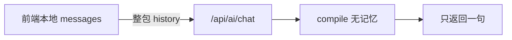
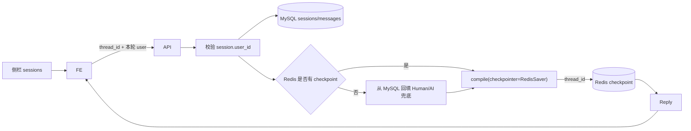

# Agent 多轮对话 + 状态隔离 + 历史会话侧栏（Redis Checkpointer 版）

## 现状问题

当前链路（[`service.py`](../backend/app/services/agent/service.py) + [`AIChat.vue`](../frontend/src/views/ai/AIChat.vue)）：

- 前端每次把整段 `messages` POST 到 `/api/ai/chat`
- `graph.compile()` **没有 Checkpointer**，服务端不记住上一轮
- 无 `thread_id`，多用户/多会话在服务端无法隔离
- 预约确认只看本次请求里的「最后一句用户话」
- 页面只有单聊区域，无历史会话列表，刷新即丢本地气泡



## 目标效果

- **多轮**：同一会话内，服务端自动带上历史（含 ToolMessage），用户说「确认」能接上前文预约草稿
- **状态隔离**：不同用户、不同会话互不串；用户只能访问自己的 `thread_id`
- **历史会话侧栏**：左侧列出当前用户的多个会话；可新建、切换、删除；切换后右侧还原该会话气泡；发消息后侧栏标题/时间更新
- **进程可重启 / 可多 worker**：Agent checkpoint 落在 Redis，不依赖单进程内存

默认选型：

| 能力 | 存储 |
|------|------|
| Agent 多轮（含 tool 中间态） | LangGraph **`RedisSaver`**（按 `thread_id`，落 Redis） |
| 侧栏列表 + 气泡回放 | MySQL **`ai_chat_sessions` + `ai_chat_messages`** |
| 归属校验 | session 行绑定 `user_id`，接口一律先鉴权 |
| Redis 不可用 / checkpoint 被清时的兜底 | 从 `ai_chat_messages` **冷启动回填**（仅文本多轮；tool 草稿仍可能丢） |

说明：

- **MySQL**：给人看的历史（侧栏、气泡、归属）。
- **Redis**：给 Agent 用的 checkpoint（含 ToolMessage）；后端重启、多 worker 可共享同一 `thread_id` 状态。
- 侧栏与气泡刷新后仍在（MySQL）；「确认预约」在 Redis 仍有该 thread 的 checkpoint 时可跨重启续上。
- 开发机 Redis：用 **Docker** 跑官方 `redis:latest`（Redis 8+ 自带 RedisJSON + RediSearch；`langgraph-checkpoint-redis` 依赖这些模块）。勿用缺模块的 Windows 本机包做验收。



---

## 基础设施与依赖

### Redis（Docker，已就绪）

当前约定：容器名 `redis`，镜像 `redis:latest`，端口 `6379:6379`。保持容器运行即可；阶段 0 从连通与模块验收开始。

| 项 | 说明 |
|----|------|
| 启动示例 | `docker run -d --name redis -p 6379:6379 redis:latest`（已有容器则 `docker start redis`） |
| 连通性 | `docker exec redis redis-cli PING` → `PONG` |
| 模块 | `docker exec redis redis-cli MODULE LIST` 须有 RedisJSON + RediSearch（常见名 `ReJSON`、`search`） |
| 连接串 | `REDIS_URL=redis://127.0.0.1:6379`（**当前无密码**；仅映射端口变更时改端口） |

开发约定：Docker Redis **未设置 requirepass**，连接串不要带 `:password@`。若日后加密码再改为 `redis://:密码@127.0.0.1:6379/0`。

**模块说明**：`langgraph-checkpoint-redis` 依赖上述模块。官方 Redis 8+ 镜像一般自带；若只有 `vectorset`、没有 `ReJSON`/`search`，不要用该实例做 Checkpointer。本机 Windows Redis（无 `modules`）仅作对照，**不要**与 Docker 争用 6379。

```bash
docker exec redis redis-cli PING
# 期望：PONG

docker exec redis redis-cli MODULE LIST
# 期望：能看到 ReJSON / search（名称因版本略有差异）
```

### Python 依赖

在 [`backend/requirements.txt`](../backend/requirements.txt) 增加（版本以实现时 PyPI 为准）：

```text
langgraph-checkpoint-redis
```

安装：`pip install langgraph-checkpoint-redis`（会拉取 `redis` / `redisvl` 等）。

### 配置

[`config.py`](../backend/app/config.py) / `.env` / [`.env.example`](../backend/.env.example) 增加：

```env
REDIS_URL=redis://127.0.0.1:6379
```

```python
# Settings 中
REDIS_URL: str = "redis://127.0.0.1:6379"
```

可选：`REDIS_CHECKPOINT_TTL`（秒）若所用 RedisSaver API 支持 TTL/过期策略则配置；否则用运维侧定期清理或接受按 key 增长（演示可暂不设）。

### 启动时 `setup()` 与生命周期

`RedisSaver` **首次**使用前需调用一次 `setup()` 创建索引（之后每次启动再调应幂等）。

建议做法（对齐现有 [`lifespan`](../backend/app/main.py) 里 `asyncio.to_thread(seed_rbac)` 风格）：

1. **不要在 import 模块时立刻连 Redis**（Redis 未起会导致整个应用 import 失败）；在 lifespan 启动阶段创建 client + `RedisSaver`，赋给模块级单例（或 `app.state`）
2. `setup()` 为同步调用 → `await asyncio.to_thread(_checkpointer.setup)`
3. **启动失败策略（演示推荐）**：连不上 Redis / `setup` 失败 → **直接阻止启动**（打日志并 raise），避免半残服务；勿静默降级成无记忆 Agent（与「默认 Redis」目标不一致）
4. **关闭**：lifespan `finally` 里关闭 Redis 连接（`client.close()`），与取消 expire 扫描任务一起做
5. `uvicorn --reload` 会重复 lifespan：依赖 `setup()` 幂等即可

可选：单独文件 [`backend/app/services/agent/checkpointer.py`](../backend/app/services/agent/checkpointer.py) 封装 `init_checkpointer()` / `get_checkpointer()` / `delete_thread(thread_id)`，供 `agent_service` 与「删会话」共用，避免循环依赖。

---

## 与当前工程的对齐要点（必读）

### 1. 主键：不要用 uuid 覆盖 `Base.id`

项目 [`database.Base`](../backend/app/database.py) 已统一：

- `id: int` 自增主键
- `create_time` / `update_time`

因此会话表必须：

- 继承 `Base`，保留 int `id`
- **另加** 唯一字段 `thread_id: str`（`uuid4`），LangGraph `configurable.thread_id` 与前端 API 都用这个字符串
- `ai_chat_messages.session_id` → 外键 `ai_chat_sessions.id`（int）

对外 API 的「会话 id」一律返回 / 接收 **`thread_id` 字符串**。

### 2. 模型必须写入 `models/__init__.py`

[`main.py`](../backend/app/main.py) 靠 `import app.models` + `create_all` 建表。新模型不导出则**表不会出现**。

### 3. Checkpointer：优先 Redis，MySQL 仅兜底冷启动

`invoke` 前用 `agent.get_state(config)` 判断该 `thread_id` 是否已有 checkpoint：

| 情况 | 入参 `messages` |
|------|-----------------|
| Redis 无 checkpoint 且无更早 MySQL 历史 | `[SystemMessage, HumanMessage(本轮)]` |
| Redis 无 checkpoint 且 MySQL 有更早历史 | `[SystemMessage, ...更早历史转 Human/AI..., HumanMessage(本轮)]`（兜底；**无 ToolMessage**） |
| Redis 已有 checkpoint | 只传 `[HumanMessage(本轮)]`，**禁止**再整包 history、**禁止**每轮重复塞 SystemMessage |

正常路径（Redis 健康）：重启后端后 `get_state` 仍有消息，**不必**走 MySQL 冷启动，tool 中间态可保留，「确认」可续上。

**禁止重复拼接本轮 user：**

1. **推荐**：先 `list_messages` 得到「本轮之前」→ 再 `add_message(user)` → 仅当无 Redis checkpoint 时用「之前的历史」冷启动 + 本轮 Human  
2. 或：先落库本轮，冷启动时去掉最后一条再追加本轮 Human  

冷启动历史过长（可选）：只取最近 N 条（如 40）。

### 4. 与现有 `agent_service` 的改法

- 通过 `get_checkpointer()` 取 lifespan 已初始化的 **RedisSaver 单例**（见上文「启动时 setup」；不要在本文件 import 时 `Redis.from_url`）
- **图仍可按请求 `compile`**：

  ```python
  def build_agent(...):
      ...
      return graph.compile(checkpointer=get_checkpointer())
  ```

- **有无 checkpoint**：
  ```python
  state = agent.get_state(config)
  has_checkpoint = bool((state.values or {}).get("messages"))
  ```
- **必须带 `thread_id`**：`config.configurable.thread_id` 不能缺
- `run_agent` 入参：`thread_id`、`prior_messages`（兜底用）、`last_user_text`；**不要**把前端整包 history 当 graph 输入
- 只改 agent 链路；旧 `ai_service.py` 已删除（已被 LangGraph Agent 替代）
- sessions / chat：`Depends(get_current_user)`

### 5. `update_time` 与软删

- 落消息后**显式** touch session 的 `update_time` / `title`
- `is_deleted` 需新增字段
- **软删时建议同时清理 Redis 中该 `thread_id` 的 checkpoint**  
  实现时查所用版本 API（常见为 checkpointer / graph 上的 `delete_thread(thread_id)` 或等价方法）。封装在 `agent_checkpointer.delete_thread`，由 `soft_delete` 调用；若版本无删除 API，文档接受残留 key（软删后禁止再 chat + 新会话新 uuid）。

### 6. 响应结构与异常风格

- `ChatReply(role, content, thread_id)` 放在 `Response.data`
- 归属失败：`BusinessException(message="无权限访问", code=403)`；不存在与非本人统一文案
- 软删 session 禁止再 chat / 拉 messages
- 前端气泡只 `push({ role, content })`，不要整包 `res.data`
- [`chatApi`](../frontend/src/api/ai.js) 超时 60s 一般够用
- **请求期 Redis 异常**（超时、连接断开）：捕获后抛 `BusinessException(message="对话服务暂不可用，请稍后重试")`，不要把底层 Redis 堆栈直接返回前端

### 7. 运行方式

- Redis 正常时：**允许多 worker**（checkpoint 共享）
- 后端重启后：同 `thread_id` 仍可续「确认预约」（Redis 未过期/未清空）
- Redis 在运行中宕机：当次请求失败提示；恢复后旧 checkpoint 若仍在则可继续

### 8. 写库必须 `db.commit()`

与现有 service 一致，session/message 写操作显式 `commit`。

### 9. Agent 失败与乐观 UI

落库 user → `run_agent` → 落库 assistant；agent 失败保留 user 气泡即可。

### 10. 配置文件同步

除本地 `.env` 外，同步改 [`backend/.env.example`](../backend/.env.example)，增加 `REDIS_URL=` 示例，方便他人克隆项目。

### 11. 默认 title 常量

代码里用同一常量，例如 `DEFAULT_SESSION_TITLE = "新对话"`；仅当 `title == DEFAULT_SESSION_TITLE` 时用首条 user 截断覆盖，避免用户改名后再被冲掉（若做了 PATCH 改名）。

### 12. 消息表查询索引

`ai_chat_messages.session_id` 建议加普通索引（FK 在部分库会自动建；MySQL InnoDB 外键会建索引，确认即可），列表按 `id` 或 `create_time` 升序。

---

## 数据模型（MySQL；相对 MemorySaver 方案字段不变，仓库里尚需新建）

### `ai_chat_sessions`

| 字段 | 说明 |
|------|------|
| `id` | int 自增主键（继承 Base） |
| `thread_id` | `String(64)`，**唯一索引**；LangGraph / 前端会话键 |
| `user_id` | FK → `users.id` |
| `title` | 默认「新对话」，首条 user `strip()[:20]` |
| `is_deleted` | 软删 |
| `create_time` / `update_time` | 继承 Base；消息后显式 touch |

### `ai_chat_messages`

| 字段 | 说明 |
|------|------|
| `id` | int 自增 |
| `session_id` | FK → `ai_chat_sessions.id` |
| `role` | `user` / `assistant` |
| `content` | **`Text`** |
| `create_time` | 升序展示 |

Tool / System 不进 MySQL；完整 Agent 状态在 Redis。

---

## 核心实现：RedisSaver + thread_id

### 1. 编译图

```python
return graph.compile(checkpointer=get_checkpointer())  # RedisSaver 单例
```

### 2. invoke

```python
config = {
    "configurable": {"thread_id": thread_id},
    "recursion_limit": 10,
}
# 有 Redis checkpoint → [HumanMessage(本轮)]
# 无 → 兜底 [SystemMessage, *prior, HumanMessage(本轮)]
agent.invoke({"messages": input_messages}, config=config)
```

### 3. 状态隔离

- 新建 session：`thread_id=str(uuid4())` 写入 MySQL
- 所有 chat/读/删：校验 `user_id` 后再动 Redis / MySQL

---

## API / Schema

相对 **MemorySaver 设计稿**，换 Redis **不改** HTTP 契约（仍是 `thread_id`）。相对**当前线上代码**则要改：整包 history → `thread_id` + 本轮 user；`ChatMessage` → `ChatReply`。

[`ChatRequest`](../backend/app/schemas/ai.py)：

- 保留 `messages: list[ChatMessage]`（前端只传本轮一条 user 即可，勿整包）
- 增加 `thread_id: str | None`；`""` 当 `None`
- 服务端**只取最后一条非空 user**

[`POST /api/ai/chat`](../backend/app/api/ai.py)：

1. 规范化 `thread_id`；取 `last_user_text`
2. 无 thread → 建 session 并 `commit`
3. 有 thread → `get_owned_by_thread`，否则 403
4. 先 `list_messages`（兜底用）→ 落库 user → touch title → `commit`
5. `run_agent`（Redis checkpoint 优先；否则 MySQL 冷启动）
6. 落库 assistant；touch；`commit`
7. 返回 `ChatReply(role, content, thread_id)`

### 会话侧栏接口

| 方法 | 路径 | 作用 |
|------|------|------|
| `GET` | `/api/ai/sessions` | 列表 |
| `POST` | `/api/ai/sessions` | 可选显式新建 |
| `GET` | `/api/ai/sessions/{thread_id}/messages` | 气泡 |
| `DELETE` | `/api/ai/sessions/{thread_id}` | 软删 + **尽量删 Redis checkpoint** |
| `PATCH` | `/api/ai/sessions/{thread_id}` | 可选改 title |

---

## 前端：侧栏 + 主聊区

与 MemorySaver 设计稿相同（左右布局、只传本轮 user + `thread_id`、按 `thread_id` 切换）。  
欢迎语仅前端；有历史不叠欢迎语。阶段 A 至少要有「新对话」；侧栏列表/切换/删除在阶段 B。

---

## 与预约确认校验的衔接

[`agent_tools.build_tools(..., last_user_text=)`](../backend/app/services/agent/tools.py)：确认关键字读本轮用户句。  
Redis 保留 tool 态后，跨重启说「确认」更可靠（仍须本轮文案命中确认关键字）。

---

## 涉及文件清单

| 动作 | 路径 |
|------|------|
| 依赖 | [`backend/requirements.txt`](../backend/requirements.txt) 增加并 pin `langgraph-checkpoint-redis`（与 `langgraph==1.2.11` 兼容） |
| 配置 | [`config.py`](../backend/app/config.py)、[`.env`](../backend/.env)、[`.env.example`](../backend/.env.example) → `REDIS_URL` |
| 启动 | [`main.py`](../backend/app/main.py) lifespan：init + `setup()` + shutdown 关连接 |
| Checkpointer 封装（推荐） | `backend/app/services/agent/checkpointer.py` |
| 新模型 | `backend/app/models/ai_chat.py` |
| 导出 | [`models/__init__.py`](../backend/app/models/__init__.py) |
| session service | `backend/app/services/agent/session_service.py` |
| schema | [`schemas/ai.py`](../backend/app/schemas/ai.py) |
| API | [`api/ai.py`](../backend/app/api/ai.py) |
| Agent | [`agent/service.py`](../backend/app/services/agent/service.py) → `get_checkpointer()` |
| 前端 | [`api/ai.js`](../frontend/src/api/ai.js)、[`AIChat.vue`](../frontend/src/views/ai/AIChat.vue) |

不改：`api/__init__.py`；旧 `ai_service.py` 已删除。

---

## 实施步骤（按顺序做）

> 仓库现状（复查时）：方案**尚未落地**——仍是整包 `messages`、`graph.compile()` 无 checkpointer、无 session 表/侧栏。下列步骤均为待做。Redis 为**仓外 Docker**（本仓无 compose），用本机已起的 `redis` 容器验收即可。

### 阶段 0：Redis 就绪

1. 确认仓外 Docker 容器 `redis` 在跑：`docker exec redis redis-cli PING` → `PONG`；`MODULE LIST` 确认有 ReJSON / search（勿用缺模块的本机 Windows Redis 验收）
2. `requirements.txt` 先加 `langgraph-checkpoint-redis`，`pip install -r requirements.txt` 试装成功后**把确切版本写回 pin**（与 `langgraph==1.2.11` 兼容）
3. `.env` + `.env.example` + `Settings` 增加 `REDIS_URL=redis://127.0.0.1:6379`（无密码；端口与 Docker 映射一致）
4. 新增 `agent/checkpointer.py`（`init` / `get` / `delete_thread`），并挂到 lifespan：
   - **勿在 import 时连 Redis**；在 lifespan 里 `init_checkpointer(REDIS_URL)`
   - `await asyncio.to_thread(checkpointer.setup)`（线程模式对齐 `seed_rbac`）
   - **失败策略与 seed/warmup 相反**：连不上 / `setup` 失败 → **raise 阻止启动**（勿吞异常继续跑半残 Agent）
   - `finally`：与取消 expire 扫描一起关闭 Redis 连接

### 阶段 A：多轮 + 隔离

5. 模型 `AiChatSession` / `AiChatMessage`（`Text`、`thread_id` 唯一、默认 title 常量；**`is_deleted` 为新建字段**，非现有模型惯例）+ 导出 `models/__init__.py`
6. `agent/session_service.py`（create / list / get_owned / soft_delete / touch / add_message / list_messages；均 `commit`）
7. `agent/service.py`：`compile(checkpointer=get_checkpointer())`；`run_agent` 入参加 `thread_id` / `prior_messages` / `last_user_text`（**不再吃整包 history**）；invoke 带 `thread_id`；有 checkpoint 只追加 Human；无则 MySQL 冷启动；Redis 异常转业务错误
8. Schema / API 契约迁移：`ChatRequest` 增加 `thread_id`；响应由 `ChatMessage` → `ChatReply(role, content, thread_id)`；`POST /api/ai/chat`（空串 thread 当新建、只取最后一条 user、先 `list_messages` 再落库 user）
9. `views/ai/AIChat.vue` 最小：本地 `threadId`、**新对话按钮**（清气泡+清 threadId）、请求只传本轮 user + `thread_id`、用返回的 `thread_id` 写回本地、`push({role,content})`（勿整包 `res.data`）

**验收 A**（只验服务端多轮；**UI 刷新回放 / 侧栏属阶段 B**）：

- 同 thread 第二轮「确认」能接上预约（页面不刷新）
- **重启后端后**（Redis 未清）再说「确认」仍可接上
- Redis 未启动时后端应无法正常起来
- 换账号 403；点「新对话」后互不影响
- 整页刷新后气泡会丢（阶段 A 预期）；侧栏回放 → 阶段 B

### 阶段 B：历史会话侧栏

10. 在现有 [`api/ai.py`](../backend/app/api/ai.py) 增加 `GET/POST/DELETE/PATCH /api/ai/sessions` 与 `GET .../{thread_id}/messages`（**不必改** `api/__init__.py`）
11. `api/ai.js` 封装 sessions / messages
12. `views/ai/AIChat.vue` 左右布局：进页拉列表、切换拉消息、删除（MySQL 软删 + **清 Redis**）、发送后刷新侧栏
13. 有消息不叠欢迎语；`loading` 时禁止切换或忽略过期响应

**验收 B**：多会话不串、切换/刷新回放、删会话后不可再续该 thread、跨用户隔离；多轮确认仍可用。

### 阶段 C（可选）

- SSE 流式；会话搜索/置顶/导出；Redis TTL；多 worker 压测同一 `thread_id`

---

## 实现步骤易漏项（复查补充）

| 遗漏点 | 应处理 |
|--------|--------|
| 只改 `.env` 忘了 `.env.example` | 同步示例，方便交接 |
| import 时连 Redis | 改为 lifespan 初始化，避免 Redis 未起时 App 无法 import |
| `setup()` 阻塞事件循环 | 用 `asyncio.to_thread`（与现有 `seed_rbac` 一致） |
| 进程退出未关 Redis | lifespan `finally` 里 `close` |
| 删会话只软删 MySQL | 尽量 `delete_thread` 清 Redis |
| 未 pin 依赖版本 | 与 `langgraph==1.2.11` 试装后写死版本号 |
| Docker/本机 Redis 已起但缺模块 | `MODULE LIST` 无 ReJSON/search 则换官方 `redis:latest`(8+) 或 Stack；与「容器在跑」不是一回事 |
| Redis 运行中报错变裸 500 | 转 `BusinessException` 友好文案 |
| 阶段 A 无「新对话」 | 至少清本地 `threadId`，否则难测隔离 |
| title 被反复截断覆盖 | 仅当标题仍为默认「新对话」时更新 |
| 冷启动与落库顺序 | 先 list「之前历史」再 add user，避免双份 Human |
| 启动失败却静默继续 | 演示推荐 Redis 挂则服务起不来，避免半残无记忆 |

---

## 实现检查清单

- [ ] Docker `redis` 已启动；`PING`/`MODULE LIST` 有 ReJSON+search；`REDIS_URL` 在 `.env` 与 `.env.example`
- [ ] `langgraph-checkpoint-redis` 已装并 pin；lifespan init/`setup`/shutdown
- [ ] Agent 用 **RedisSaver** 单例；非 import 期强连
- [ ] `thread_id` 唯一；空串当 `None`；`content` 用 `Text`；默认 title 常量
- [ ] 模型已进 `models/__init__.py`；写操作 `db.commit()`
- [ ] 只取最后一条 user；有 checkpoint 只追加 Human；invoke 必带 `thread_id`
- [ ] Redis 无状态时才 MySQL 冷启动，且不重复本轮 user
- [ ] 归属 403；软删不可聊；删会话尽量清 Redis
- [ ] Redis 异常有业务提示；前端只 `push` role/content；有历史不叠欢迎语；有新对话入口
- [ ] 验收：多轮确认、重启后端后续确认、侧栏切换/刷新/删除

### 终检结论（对照仓库）

| 核对项 | 结果 |
|--------|------|
| 现状描述 | 与代码一致：无 checkpointer、整包 history、无 session/侧栏 |
| Base / models 导出 / lifespan / `BusinessException(code=)` / `chatApi` 60s | 与工程约定一致 |
| `langgraph==1.2.11`、无 `REDIS_URL`、无 compose | 与依赖/配置现状一致；Redis 仓外 Docker |
| 步骤 0→A→B | 顺序正确，无需重排 |
| 文件清单 | 路径齐全；`api/__init__.py` 已挂 ai 路由，sessions 加在 `api/ai.py` 即可 |

**可以按阶段 0 开工。** 实现时勾「易漏项」+「检查清单」；勿照搬 seed/warmup 的「失败继续启动」。

---

## 最终技术核对

| 点 | 说明 |
|----|------|
| 勿重复喂历史 | 有 Redis checkpoint 只追加本轮 Human |
| 勿整包进 graph | 服务端只取最后一条 user |
| `thread_id` | 有则续聊；空串/`None` 当新建 |
| checkpointer 单例 | lifespan 初始化；请求内可重新 `compile` |
| Redis 模块 | RedisJSON + RediSearch（Docker 官方 Redis 8+ / Stack） |
| 欢迎语 | 仅前端 |
| 软删 | MySQL + 尽量删 Redis checkpoint |
| title | 仅默认标题时 `strip()[:20]` |
| 与 MemorySaver 差异 | 可多 worker；重启后续 tool 态；冷启动为兜底 |

---

## 不做的范围（本方案默认）

- 不上 SSE 流式（阶段 C）
- **不用** `MemorySaver` 作为默认
- 不把气泡主存储迁到 Redis
- 不把 ToolMessage 展示到侧栏
- 不做同 thread 并发锁（前端 `loading` 即可）
- 阶段 A 不做 `localStorage` 持久化 `threadId`
- 不在 Redis 宕机时静默降级为「无记忆还能假装正常聊」
