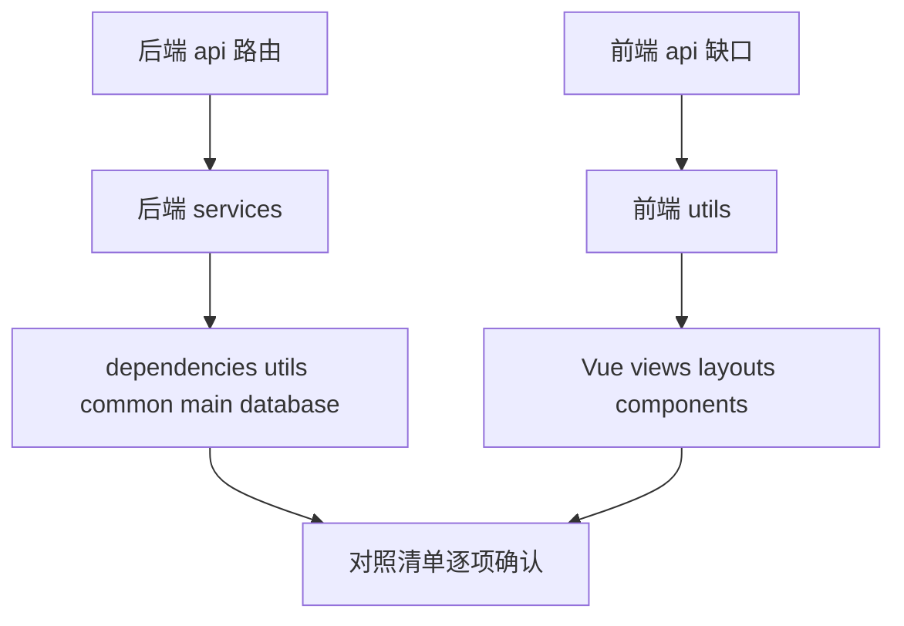

# 方法注释补全说明

> 状态：**方案待落地**（本文仅约定规范与范围；代码补注释在确认后另开一轮）。  
> 对照仓库：后端 FastAPI 路由多数无 docstring；服务层覆盖不齐；前端 `api/` 部分有一行 JSDoc，Vue 页面方法几乎无注释。

## 1. 目的与非目标

### 1.1 目的

- 为前后端**具名方法 / 函数**补上简体中文一行说明，降低阅读与协作成本。
- 对齐仓库里已有写法（中文一行 docstring / JSDoc），形成可执行清单。
- **不改**业务逻辑、API URL、菜单 path、表结构、函数命名与实现。

### 1.2 非目标

- 不引入 Google / NumPy / reST 大段 `Args:` / `Returns:` 模板。
- 不强制为 FastAPI 路由加 `summary=` / `description=`（避免顺带改 OpenAPI 观感）。
- 不给 `models` 列、`schemas` 字段补 `Field(description=...)`（本轮只补方法）。
- 不引入 TypeScript、不写 Doxygen、不为注释而重构。
- Agent 多轮设计说明仍以 [`Agent多轮对话与状态隔离.md`](./Agent多轮对话与状态隔离.md) 为准，不在函数上重复长文。

---

## 2. 现状

### 2.1 后端

| 区域 | 现状 |
|------|------|
| `app/api/*.py` | 多数路由无 docstring；`user.py` 部分有、`files.upload` / `menu.get_my_menus` 等零星有 |
| `app/services/**` | 不均：`kb_service`、`equipment_service`、Agent 子包相对全；`lab_service` 仅列表有；CRUD 大量缺 |
| `dependencies/`、`utils/`、`common/` | 多数已有中文一行 |
| `models/`、`schemas/` | 几乎无方法；列上已有 `comment=`，**本轮跳过** |

典型缺口（无文档）：

```python
# backend/app/api/lab.py
def get_lab_list(...):
    res = lab_service.get_lab_page_list(...)
    return Response.success(data=res)
```

已有达标样式：

```python
# backend/app/services/equipment_service.py
def get_equipment_page_list(...):
    """分页模糊查询列表"""
```

### 2.2 前端

| 区域 | 现状 |
|------|------|
| `src/api/*.js` | 多数一行 JSDoc；**整文件缺口**：`ai.js`、`files.js`；`auth.registerApi` 无 |
| `src/utils/*` | 行注释为主；导出方法 / `useUser` 内部方法多数无 JSDoc |
| `views/**`、`layouts/`、`components/` | 几乎无 JSDoc；偶有 `// 保存` 等空话行注释 |
| TypeScript | **无**；不能靠类型替代注释 |

典型缺口：[`frontend/src/api/ai.js`](../frontend/src/api/ai.js) 全部导出函数。

达标样式：

```js
/** 分页查询实验室 */
export function getLabPageList(params) { ... }
```

---

## 3. 注释规范

### 3.1 通用

- **语言**：简体中文。
- **长度**：一行优先；确有必要（鉴权、软删、冷启动）可两行，仍不要 `Args`/`Returns` 块。
- **写什么**：职责 + 非显而易见约束（角色、软删、超时、分页字段、仅本人等）。
- **不写**：复述函数名的空话（如仅写「保存」「新增」「删除」）；不复制大段设计文档。
- **旧注释怎么处理**：
  - **空话可改**：旧 docstring / JSDoc 若仅复述动词、无职责/约束信息（如 `"""新增"""`、`"""删除"""`、`/** 保存 */`），**允许**改写成带职责/约束的一句。
  - **有实质信息不改**：已有准确、含约束或职责信息的一句，保持原样，不无故改写。
- **禁止**：改实现、改命名、为写注释而重构。

### 3.2 后端（Python）

紧跟 `def` / `async def` 使用一行 docstring：

```python
def create_lab(
    data: LabCreateRequest,
    current_user: User = Depends(require_roles("admin")),
    db: Session = Depends(get_db),
):
    """新增实验室（需 admin）"""
    ...
```

- `_` 前缀内部函数也补一句，说明「为何存在」。
- 类方法（如 `Response.success`）若缺说明可补；类本身已有 docstring 的保持。
- FastAPI：**只写 docstring**，不强制加 `summary=`。

**反例**（空话 docstring，落地时应按 §3.1 改写）：

```python
def create_lab(...):
    """创建"""  # 空话；应改为如「新增实验室（需 admin）」
```

### 3.3 前端（JS / Vue SFC）

导出函数、`utils` 导出/内部具名方法、以及 `<script setup>` 中的**具名方法一律**补一行 JSDoc（与 `api/lab.js`、§4.3 一致），不论是否「看起来 trivial」：

```js
/** 发送多轮对话（超时 60s） */
export function chatApi(data) { ... }

/** 拉取分页列表并刷新表格 */
const load = async () => { ... }
```

- 不强制 `@param` / `@returns`（项目无 TS）。
- **不注释**（仅此两类）：匿名回调、模板内联表达式。
- `router.beforeEach` 等已有块注释可保留；不必再包一层空 JSDoc。

**反例**：

```js
/** 保存 */
const handleSave = async () => { ... }  // 空话
```

---

## 4. 覆盖范围

### 4.1 后端必补

- [`backend/app/api/`](../backend/app/api/) 全部路由处理函数
- [`backend/app/services/`](../backend/app/services/) 全部顶层函数（含 `agent/`、`rbac_seed`）
- [`backend/app/dependencies/`](../backend/app/dependencies/)、[`utils/`](../backend/app/utils/)、[`common/`](../backend/app/common/) 中的函数 / 类方法
- [`main.py`](../backend/app/main.py) 的 `lifespan`、`root`
- [`database.get_db`](../backend/app/database.py)

### 4.2 后端跳过

- `models/`、`schemas/`（无业务方法或仅有校验器且已够自解释时可跳过）
- 已有**实质信息**的中文一行 docstring（空话按 §3.1 允许改写，不算「跳过」）
- 模块级大段说明（如 checkpointer 模块 docstring）不重复展开

### 4.3 前端必补缺口

- `api/ai.js`、`api/files.js`、`auth.registerApi`
- `utils/user.js`、`utils/auth.js` 导出及内部 helper；`request.js` 若仅有拦截器行注释可保持，导出 default 不必强行 JSDoc
- 各 `views/**`、`layouts/Layout.vue`、`components/ReserveDialog.vue` 中的 `load` / `handle*` / `resetForm` 等具名方法

### 4.4 前端保持不动

- 已有**实质信息**的一行 JSDoc（`api/*.js` 等）；空话按 §3.1 允许改写

---

## 5. 文件清单

图例：**缺** = 需补；**部分有** = 补缺项、保留已有实质注释（空话按 §3.1 可改）；**基本有** = 逐函数确认覆盖，缺则补、空话可按 §3.1 改写；**跳过** = 本轮不改。

### 5.1 后端

| 文件 | 状态 | 备注 |
|------|------|------|
| `app/api/auth.py` | 缺 | `login` / `register` |
| `app/api/lab.py` | 缺 | 全部路由 |
| `app/api/equipment.py` | 缺 | 全部路由 |
| `app/api/reservation.py` | 缺 | 全部路由 |
| `app/api/role.py` | 缺 | 全部路由 |
| `app/api/menu.py` | 部分有 | 补 CRUD；`get_my_menus` 已有 |
| `app/api/user.py` | 部分有 | 个人信息已有；补列表/CRUD |
| `app/api/ai.py` | 缺 | 路由 + `_fmt_dt` 等 helper |
| `app/api/files.py` | 基本有 | 逐函数确认；`upload` 已有实质说明则保持 |
| `app/api/__init__.py` | 跳过 | 无方法 |
| `app/services/lab_service.py` | 部分有 | 仅列表有 docstring |
| `app/services/equipment_service.py` | 基本有 | 逐函数确认，缺则补、空话可改 |
| `app/services/reservation_service.py` | 基本有 | 逐函数确认；含 `expire_*` 等 |
| `app/services/user_service.py` | 部分有 | 补 `_` helper 与缺项 |
| `app/services/role_service.py` | 缺 | 当前零 docstring，按函数全部补 |
| `app/services/menu_service.py` | 部分有 | 补 CRUD 等 |
| `app/services/auth_service.py` | 缺 | `login` / `register` |
| `app/services/kb_service.py` | 基本有 | 逐函数确认；已有实质 docstring 保持 |
| `app/services/rbac_seed.py` | 基本有 | 逐函数确认；`seed_rbac` 已有则保持 |
| `app/services/agent/service.py` | 部分有 | 补 `build_agent` / `_extract_*` 等 |
| `app/services/agent/session_service.py` | 部分有 | 补 `create_session` / `list_*` / `soft_delete` 等 |
| `app/services/agent/checkpointer.py` | 部分有 | 补 `get_checkpointer` |
| `app/services/agent/tools.py` | 基本有 | 逐函数确认；tool 内给 LLM 的 docstring 保持；补 `_user_confirmed` |
| `app/dependencies/auth.py` | 基本有 | 逐函数确认；已有实质说明保持 |
| `app/utils/jwt.py`、`password.py` | 基本有 | 逐函数确认；已有实质说明保持 |
| `app/common/response.py` | 部分有 | 类有；可补 `success`/`error` |
| `app/common/exceptions.py` | 基本有 | 逐函数确认；已有实质说明保持 |
| `app/main.py` | 缺 | `lifespan` / `root` |
| `app/database.py` | 缺 | `get_db` |
| `app/config.py` | 跳过 | 无业务方法 |
| `app/models/*`、`app/schemas/*` | 跳过 | 本轮不补字段说明 |

### 5.2 前端

| 文件 | 状态 | 备注 |
|------|------|------|
| `api/ai.js` | 缺 | 6 个导出全部补 |
| `api/files.js` | 缺 | `uploadFileApi` |
| `api/auth.js` | 部分有 | 补 `registerApi` |
| `api/lab.js`、`equipment.js`、`user.js`、`menu.js`、`role.js`、`reservation.js` | 基本有 | 逐函数确认；已有实质 JSDoc 保持，空话可改 |
| `utils/auth.js` | 缺/部分 | 导出及内部具名方法一律补一行 |
| `utils/user.js` | 缺 | `useUser` 内外具名方法一律补一行 |
| `utils/request.js` | 基本有 | 逐函数确认；拦截器已有行注释可保持 |
| `router/index.js` | 基本有 | 逐函数确认；已有白名单/守卫说明可保持 |
| `layouts/Layout.vue` | 缺 | `toggleCollapse` / `filterVisible` 等 |
| `components/ReserveDialog.vue` | 缺 | `handleSubmit` |
| `views/ai/AIChat.vue` | 缺 | 会话/发送/markdown 等 |
| `views/lab/*.vue` | 缺 | CRUD / 预约相关方法 |
| `views/system/*.vue` | 缺 | User / Role / Menu |
| `views/reservation/*.vue` | 缺 | 我的预约 / 审核 |
| `views/auth/*.vue` | 缺 | 登录注册资料密码 |
| `views/Home.vue` | 缺 | `flattenMenus` 等 |
| `main.js`、`App.vue` | 跳过 | 无业务方法或极简 |

---

## 6. 落地顺序（代码阶段）

确认本方案后，按下列顺序改代码（仍**只加注释**）：



1. **后端** `api/` → `services/`（含 `agent/`）→ `dependencies` / `utils` / `common` / `main` / `database`
2. **前端** `api/` 缺口 → `utils/` → `views` + `layouts` + `components`
3. **收尾**：对照第 5 节清单逐函数确认；`git diff` 应几乎只有注释行；将本文状态改为「代码已按本文落地」

---

## 7. 检查项

落地完成后自检：

- [ ] 每个**必补**导出函数 / 路由 / service 顶层函数有一句中文说明
- [ ] `_` 内部 helper 有一句「为何存在」的说明
- [ ] 前端 `<script setup>` / `utils` 具名方法均有一行 JSDoc（仅匿名回调、模板内联不注释）
- [ ] 空话旧注释已按 §3.1 改写；已有实质信息的注释未被无故改写
- [ ] `git diff` 无逻辑、签名、字符串文案、配置变更
- [ ] 未新增 `summary=` / OpenAPI 大段描述（除非另开需求）
- [ ] 前端未对匿名回调、模板表达式滥加注释
- [ ] 本文状态行已更新为已落地

---

## 8. 示例对照（落地模板）

### 8.1 后端路由

```python
@router.get("/list")
def get_lab_list(...):
    """分页查询实验室列表（需登录）"""
    ...
```

### 8.2 后端服务

```python
def soft_delete(db: Session, user: User, thread_id: str) -> None:
    """软删本人会话，并尽力清理 Redis checkpoint"""
    ...
```

### 8.3 前端 API

```js
/** 新建 AI 会话 */
export function createSessionApi(data) { ... }
```

### 8.4 前端页面方法

```js
/** 提交表单：有 id 则更新，否则新增 */
const handleSave = async () => { ... }
```

---

## 9. 相关文档

- [`项目结构规范改造.md`](./项目结构规范改造.md) — 目录与模块边界
- [`Agent多轮对话与状态隔离.md`](./Agent多轮对话与状态隔离.md) — AI 会话契约（注释中可点到职责，细节以该文为准）
- [`用户角色菜单设计.md`](./用户角色菜单设计.md) — RBAC；鉴权相关注释可点到角色/权限约束
