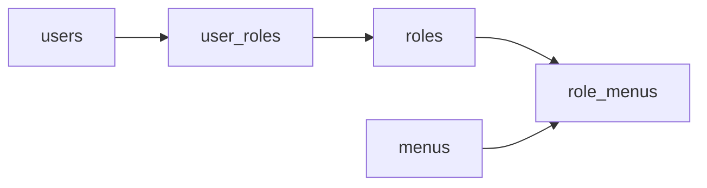

# 智能实验室预约系统 —— 用户 / 多角色 / 菜单 设计说明

## 1. 背景与目标

### 现状

- 用户表用字符串字段 `users.role`（仅 `admin` / `student`）
- 后端用 `get_current_admin` 判断 `role == "admin"`
- 前端侧栏、首页入口用 `v-if="role === 'admin'|'student'"` 写死
- 无角色表、菜单表，无法灵活配置

### 目标

引入 **多角色 RBAC**：

- 一个用户可拥有多个角色
- 一个角色可绑定多个菜单
- 登录后按「多角色菜单/权限并集」展示侧栏并做鉴权
- 后台可维护角色、菜单及二者关联

---

## 2. 总体关系

```text
users ──< user_roles >── roles ──< role_menus >── menus
```



**权限合并策略（固定）：并集放行**  
用户只要任一角色拥有某菜单/权限码，即可访问（不做「显式拒绝」）。

---

## 3. 数据模型

### 3.1 `roles` 角色表

继承项目 `Base`（自动含 `id`、`create_time`、`update_time`，模型文件里不必重复声明 `id`）。

| 字段 | 说明 |
|------|------|
| id | 主键（来自 `Base`） |
| code | 角色编码，唯一（如 `admin`、`student`） |
| name | 显示名 |
| status | 状态：`0` 禁用，`1` 启用（与现有表一致用 int） |
| remark | 备注 |

### 3.2 `menus` 菜单表

同样继承 `Base`。

| 字段 | 说明 |
|------|------|
| id | 主键（来自 `Base`） |
| parent_id | 父菜单，树形结构；根节点为 `NULL` |
| name | 菜单名称 |
| type | 类型：建议 `dir` 目录 / `menu` 菜单 / `button` 按钮（实现时固定枚举，勿混用中文） |
| path | 前端路由，如 `/manager/lab`；按钮类型可为空 |
| component | 前端组件标识（可选） |
| icon | 图标名 |
| permission | 权限码，如 `lab:write`；侧栏菜单也可先留空，接口鉴权第一期可用角色码 |
| sort | 排序，数值越小越靠前 |
| visible | 是否在侧栏显示：`0` 否，`1` 是 |
| status | 状态：`0` 禁用，`1` 启用 |

### 3.3 `role_menus` 角色-菜单

纯关联表，**不单独设 `id`**，用联合主键即可。

| 字段 | 说明 |
|------|------|
| role_id | **ForeignKey → `roles.id`**，联合主键之一 |
| menu_id | **ForeignKey → `menus.id`**，联合主键之一 |

### 3.4 `user_roles` 用户-角色

| 字段 | 说明 |
|------|------|
| user_id | **ForeignKey → `users.id`**，联合主键之一 |
| role_id | **ForeignKey → `roles.id`**，联合主键之一 |

### 3.5 `menus.parent_id`（自关联）

| 字段 | 说明 |
|------|------|
| parent_id | **ForeignKey → `menus.id`**，可空；根菜单为 `NULL` |

树形菜单靠自关联外键保证父节点存在；ORM 侧可用 `parent` / `children` 的 `relationship`。

### 3.6 `users` 变更

- **删除** 字符串字段 `role`
- 角色关系仅通过 `user_roles` 表达
- 增加 ORM：`roles: Mapped[list[Role]] = relationship(secondary=user_roles, ...)`

### 3.7 外键与 relationship（必须与现有 models 风格一致）

和现有 `Equipment.lab`、`Reservation.user/lab/equipment` 一样：**关联既要 ForeignKey，也要 relationship**。

| 模型 | ForeignKey（库约束） | relationship（代码导航） |
|------|----------------------|--------------------------|
| `User` | 经 `user_roles.user_id` | `user.roles` → 多角色列表 |
| `Role` | 经 `user_roles` / `role_menus` | `role.users`、`role.menus` |
| `Menu` | `parent_id`；经 `role_menus.menu_id` | `menu.parent`、`menu.children`、`menu.roles`（可选） |
| `user_roles` | `user_id`、`role_id`（联合主键） | 作为 `secondary`，一般不必单独 Model |
| `role_menus` | `role_id`、`menu_id`（联合主键） | 同上 |

推荐写法示意（中间表无单独 `id`）：

```python
# 中间表：联合主键，不设自增 id
user_roles = Table(
    "user_roles",
    Base.metadata,
    Column("user_id", ForeignKey("users.id"), primary_key=True),
    Column("role_id", ForeignKey("roles.id"), primary_key=True),
)

role_menus = Table(
    "role_menus",
    Base.metadata,
    Column("role_id", ForeignKey("roles.id"), primary_key=True),
    Column("menu_id", ForeignKey("menus.id"), primary_key=True),
)

# User
roles: Mapped[list["Role"]] = relationship(secondary=user_roles, back_populates="users")

# Role
users: Mapped[list["User"]] = relationship(secondary=user_roles, back_populates="roles")
menus: Mapped[list["Menu"]] = relationship(secondary=role_menus, back_populates="roles")

# Menu
parent_id: Mapped[int | None] = mapped_column(ForeignKey("menus.id"), nullable=True)
parent: Mapped["Menu | None"] = relationship(remote_side=...)
children: Mapped[list["Menu"]] = relationship(...)
roles: Mapped[list["Role"]] = relationship(secondary=role_menus, back_populates="menus")
```

**为什么要加外键与 relationship：**

- ForeignKey：禁止脏数据（绑不存在的角色/菜单）
- relationship：登录后可 `user.roles`、角色配菜单可 `role.menus`，算菜单并集更方便

### 3.8 用户菜单 / 权限如何计算

```text
用户可见菜单 = DISTINCT menus
  ← role_menus ← roles ← user_roles
  WHERE user_id = 当前用户
    AND menu.status = 启用
    （侧栏再按 visible 过滤）

用户权限码集合 = 上述菜单中非空 permission 的并集
```

---

## 4. 种子数据（与现网对齐）

### 角色

| code | name |
|------|------|
| admin | 管理员 |
| student | 学生 |

### 菜单（示例，对齐现有侧栏）

| 名称 | path | type | 建议绑定 |
|------|------|------|----------|
| 系统首页 | `/manager/home` | menu | admin + student |
| AI智能助手 | `/manager/ai-chat` | menu | admin + student |
| 实验室列表 | `/manager/lablist` | menu | student |
| 实验室管理 | `/manager/lab` | menu | admin |
| 设备列表管理 | `/manager/equipment` | menu | admin |
| 用户管理 | `/manager/user` | menu | admin |
| 我的预约 | `/manager/my-reservation` | menu | student |
| 预约审核 | `/manager/audit-reservation` | menu | admin |
| 实验室设备 | `/manager/lab-equipment` | menu | admin（前端已有路由，侧栏可挂或不挂） |
| 角色管理 | `/manager/role` | menu | admin（新增） |
| 菜单管理 | `/manager/menu` | menu | admin（新增） |

种子阶段 `permission` 可先为空；接口仍用 `require_roles("admin")`。第二期再给菜单补权限码并改 `require_permissions`。

### 旧数据迁移

- 原 `users.role = 'admin'` → 插入 `user_roles(user_id, admin角色id)`
- 原 `users.role = 'student'` → 插入 `user_roles(user_id, student角色id)`
- 迁移完成后删除 `users.role` 列
- 建议：先上线「双写/只读新表」，再删列，避免生产直接丢字段

### 删除与边界（实现时约定）

| 场景 | 建议 |
|------|------|
| 删除角色 | 若仍有用户绑定，禁止删除或先清空 `user_roles`；并清理 `role_menus` |
| 删除菜单 | 同步清理 `role_menus`；有子菜单时禁止删或级联策略写清 |
| 用户无任何角色 | `/menu/my` 返回空（或仅白名单页）；业务接口按无权限 403 |
| 角色/菜单 CRUD 接口 | 仅 `admin`（或后续 `role:write` / `menu:write`）可访问 |
| 去掉自己最后一个 `admin` | 应拦截，避免系统无人可管 |
---

## 5. 后端改动

### 5.1 新增接口

| 模块 | 示例路径 | 说明 |
|------|----------|------|
| 角色 | `/api/role/list`、CRUD | 角色维护 |
| 角色绑菜单 | `PUT /api/role/{id}/menus` | body: `menu_ids[]` |
| 菜单 | `/api/menu/tree`、CRUD | 树形维护 |
| 我的菜单 | `GET /api/menu/my` | 当前用户多角色菜单并集 |
| 用户绑角色 | 用户 CRUD 带 `role_ids[]`，或 `PUT /api/user/{id}/roles` | 多选绑定 |

建议新增文件：

- `backend/app/models/role.py`
- `backend/app/models/menu.py`
- `backend/app/api/role.py` / `menu.py`
- `backend/app/services/role_service.py` / `menu_service.py`
- `backend/app/schemas/role.py` / `menu.py`

### 5.2 登录 / 注册

- 注册：写入 `user_roles`，默认只绑 `student`
- 登录与 `/user/me` 返回建议字段：

```json
{
  "id": 1,
  "username": "zhangsan",
  "name": "张三",
  "roles": [
    { "id": 1, "code": "student", "name": "学生" },
    { "id": 2, "code": "admin", "name": "管理员" }
  ],
  "permissions": ["lab:read", "lab:write", "user:write"],
  "role": "admin"
}
```

说明：`role` 为兼容旧前端的推导字段（例如含 `admin` 则取 `admin`，否则取第一个角色的 `code`）。新逻辑应优先用 `roles` / `permissions`。

### 5.3 鉴权

替换现有：

```python
# 旧
if current_user.role != "admin":
    ...
```

改为：

```python
def has_role(user, code: str) -> bool: ...
def has_permission(user, code: str) -> bool: ...

# Depends 工厂
require_roles("admin")
require_permissions("user:write")
```

- 原 `get_current_admin` → `require_roles("admin")`，再逐步细化为权限码
- 预约列表等业务中的 `role != "admin"` → `has_role(user, "admin")`
- 加载用户时 `joinedload(User.roles)`，避免 N+1
- 顺手修正：`tokenUrl="/api/autrh/login"` → `/api/auth/login`

### 5.4 涉及改造的现有文件（示例）

- `backend/app/models/user.py`
- `backend/app/dependencies/auth.py`
- `backend/app/services/auth_service.py`
- `backend/app/services/user_service.py`
- `backend/app/services/reservation_service.py`
- `backend/app/schemas/user.py`
- `backend/app/api/__init__.py`
- `backend/app/main.py`（启动幂等 seed）

---

## 6. 前端改动

### 6.1 登录态与工具函数

- 登录成功后请求 `GET /api/menu/my`，缓存 `menus`、`roles`、`permissions`
- `utils/user.js` 增加：
  - `hasRole(code)`
  - `hasPermission(code)`
  - `hasAnyRole(codes)`
- 新增 `api/role.js`、`api/menu.js`

### 6.2 动态侧栏

- 改造 `layouts/Layout.vue`：删除写死的 `v-if="role === ..."`，按 `menus` 树递归渲染 `el-menu`

### 6.3 路由守卫

- `router/index.js`：
  1. 无 token → 登录页
  2. 进入业务页时：path 不在「我的菜单」且不在白名单（如 `home` / `profile` / `password`）→ 回首页或无权限页
- 路由组件仍可静态注册；**可见性与准入由菜单数据驱动**
- 新增页面时需在 `router/index.js` 增加：`role`、`menu` 等 child 路由（与现有 `user`、`lab` 同级），否则动态菜单点进去会 404

### 6.4 管理页面

| 页面 | 说明 |
|------|------|
| `views/system/Role.vue` | 角色 CRUD + 菜单树勾选 |
| `views/system/Menu.vue` | 菜单树 CRUD |
| `views/system/User.vue` | 角色改为 **多选** `role_ids` |
| `views/Home.vue` | 快捷入口由菜单并集生成 |
| `views/auth/Profile.vue` | 展示多个角色名 |

---

## 7. 实施顺序建议（对照当前项目）

### 7.1 当前项目现状（改造前）

| 位置 | 现状 | 与目标差距 |
|------|------|------------|
| `models/` | 仅 user/lab/equipment/reservation，**无** role/menu | 需新建模型与关联表 |
| `models/user.py` | 字符串字段 `role` | 改为 `user_roles` 多对多，删 `role` |
| `dependencies/auth.py` | `get_current_admin` 判断 `role == "admin"`；`tokenUrl` 仍为 `/api/autrh/login` | 改为 `has_role`；修正 auth 路径 |
| `auth_service.py` | 注册写死 `role="student"` | 改为写入 `user_roles` |
| `user_service` / `schemas/user` | CRUD 用字符串 `role` | 改为 `role_ids[]`，响应带 `roles` |
| `reservation_service.py` | `current_user.role != "admin"` | 改为 `has_role` |
| `api/lab|equipment|user|reservation` | `Depends(get_current_admin)` | 换依赖或改实现 |
| `main.py` | 仅 `Base.metadata.create_all`，lifespan 只预热 KB | 需 **import 新模型** 否则建不出表；加幂等 seed |
| `api/__init__.py` | 无 role/menu 路由 | 注册新路由 |
| `Layout.vue` / `Home.vue` | `role === 'admin'/'student'` 写死菜单 | 动态菜单 |
| `User.vue` / `Profile.vue` | 单角色展示/编辑 | 多角色 |
| `router/index.js` | 只校验 token，无权限；无 role/menu 路由 | 菜单 path 守卫 + 注册新页 |
| 前端 api | 无 `role.js` / `menu.js` | 新建 |

> 结论：文档目标尚未落地，下列步骤均从 0 开始；步骤写细是为了避免漏改现有文件。

### 7.2 推荐任务步骤（可勾选）

#### 阶段 A：库表与种子（后端）

- [ ] 新建 `models/role.py`、`models/menu.py`（含 `user_roles` / `role_menus` 的 `Table`）
- [ ] 改 `models/user.py`：去掉 `role` 字段，加 `roles` relationship
- [ ] 在 `main.py`（或 `models/__init__.py`）**显式 import 所有模型**，保证 `create_all` 能建出新表
- [ ] 编写幂等 `seed_rbac()`：插入 admin/student 角色、种子菜单、`role_menus`；已有用户按旧 `role` 字符串写入 `user_roles`
- [ ] **迁移策略（现有 MySQL 已有数据时）**：
  1. 先加新表 + 保留 `users.role`
  2. seed / 脚本把旧 `role` 灌进 `user_roles`
  3. 确认无误后再删 `users.role` 列（`create_all` **不会**自动删列，需手写 SQL 或迁移脚本）
- [ ] 启动时调用 seed（可放 lifespan，与 KB warmup 并列）

#### 阶段 B：后端 API 与鉴权

- [ ] `schemas/role.py`、`schemas/menu.py`、`schemas/user.py`（`roles`、`role_ids`、兼容字段 `role`）
- [ ] `services/role_service.py`、`menu_service.py`；扩展 `user_service` / `auth_service`
- [ ] `api/role.py`、`api/menu.py`（含 `GET /menu/my`、`PUT /role/{id}/menus`）；注册到 `api/__init__.py`
- [ ] `dependencies/auth.py`：`has_role` / `has_permission` / `require_roles`；`get_current_user` 使用 `joinedload(User.roles)`；修正 `autrh` → `auth`
- [ ] 替换所有 `get_current_admin` 与业务内 `role == "admin"`（至少：`api/user|lab|equipment|reservation`、`reservation_service`）
- [ ] 角色/菜单管理接口本身加 `require_roles("admin")`
- [ ] 删除角色/菜单、去掉最后一个 admin 等边界校验（见 §4）

#### 阶段 C：前端动态菜单与守卫

- [ ] 新增 `api/role.js`、`api/menu.js`
- [ ] `utils/user.js`：缓存 `menus`/`roles`/`permissions`；`hasRole` / `hasPermission`
- [ ] 登录成功或进入 Layout 时拉取 `GET /menu/my`（建议 Layout `onMounted` + 登录后各拉一次，避免刷新丢菜单）
- [ ] `Layout.vue`：按菜单树渲染；`menu.icon` 与 Element Plus 图标映射表
- [ ] `router/index.js`：注册 `/manager/role`、`/manager/menu`；白名单 `home/profile/password`；非菜单 path 拦截
- [ ] 可选：简单 403/无权限页

#### 阶段 D：管理页与收尾

- [ ] `views/system/Role.vue`（列表 + 菜单树勾选）
- [ ] `views/system/Menu.vue`（树 CRUD）
- [ ] `views/system/User.vue`：角色多选 `role_ids`；展示多角色标签
- [ ] `views/Home.vue`：快捷入口来自 menus，去掉写死 admin 分支
- [ ] `views/auth/Profile.vue`：展示 `roles` 列表
- [ ] 全局搜索清理前端 `role === 'admin'|'student'`（Layout/Home/User/Profile 等）
- [ ] 联调验收：对照 §9；分别测纯 student、纯 admin、双角色用户

### 7.3 步骤里原先缺少、现已点明的补充

| 补充项 | 原因 |
|--------|------|
| 模型必须被 import | 否则 `create_all` 建不出 roles/menus |
| `users.role` 删列不能靠 create_all | 现网库要手写迁移 |
| 登录与 Layout 谁拉菜单 | 刷新页面只靠 login 会丢菜单 |
| icon 映射 | 库里存字符串，侧栏要转组件 |
| 新路由注册 | 有菜单 path 无路由会 404 |
| 鉴权文件完整清单 | 避免漏改 `reservation_service` 等 |
| admin 自防与空角色 | 生产安全 |
| 一期 permission 可空 | 与种子、鉴权节奏一致 |
| Agent/AI 聊天 | 不依赖菜单，但预约仍依赖用户身份；RBAC 改 User 后注意 `joinedload` 不影响 agent |

### 7.4 对照代码后仍建议补进步骤的细项

| 细项 | 当前代码点 | 建议写入哪一阶段 |
|------|------------|------------------|
| `GET /user/me` 返回 `roles` | `Profile.vue` 调 `getUserInfoApi`，现只认单个 `role` | 阶段 B schemas + user_service |
| 用户表单角色选项来自接口 | `User.vue` 写死 student/admin 两个 `el-option` | 阶段 D：下拉改为 `GET /role/list` |
| 本人改资料禁止改角色 | `update_user_info` 已 `exclude role`；改多角色后仍要 **禁止提交 `role_ids`** | 阶段 B |
| 登录态与菜单分拆 | `saveLoginData` 只存 `token`+`user`；无 menus | 阶段 C：另存 menus，或 Layout 必拉 |
| 前端 403 与 401 区分 | `request.js` 现主要处理 401 登出 | 阶段 C：403 提示无权限，不要当登出 |
| 种子 path 与路由完全一致 | 路由为 `/manager/xxx`（见 `router/index.js`） | 阶段 A：种子 path 必须同前缀，守卫才能匹配 |
| 注册页 | `Register.vue` 无角色选择 | 一般不用改；后端绑 student 即可 |
| AIChat 的 `role` | 消息里的 user/assistant，**不是** RBAC | 清理前端时不要误改 AIChat |
| 双角色并集回归 | 旧 Layout 是 student/admin **互斥** `v-if` | 阶段 D 必测：admin+student 应同时看到两边菜单 |

### 7.5 建议不要纳入本期的内容

- 按钮级权限（`type=button`）精细到每个 API（二期再用 `permission`）
- 一人多租户 / 数据权限（本系统按角色看菜单 + admin 看全部预约即可）
- 动态后端注册 Vue 组件名（继续静态 `router` + 菜单 path 对齐即可）
- 改造 `AIChat` / Agent 工具鉴权（与菜单无关，保持登录即可）

---

## 8. 兼容与边界

- 短期保留响应字段 `role`，降低改爆风险；新功能用 `roles` / `permissions` / `menus`
- 注册用户默认仅 `student`；管理员可在用户管理中追加角色（如同时具备 `admin` 与自定义角色）
- `profile`、`password` 建议路由白名单放行，不必强依赖菜单绑定
- 权限冲突不做拒绝列表，统一 **并集放行**

---

## 9. 验收清单

- [ ] 用户可绑定多个角色并正确落库  
- [ ] 角色可勾选菜单，学生/管理员侧栏与现网能力对齐，且可配置新菜单  
- [ ] 同时拥有 admin+student 时，侧栏为两者菜单并集  
- [ ] 无菜单权限的用户无法靠改 URL 进入管理页（路由守卫生效）  
- [ ] 原仅 admin 可访问的接口，无 admin 角色时返回 403  
- [ ] 新注册用户默认为 student，功能与改造前一致  
- [ ] 服务重启后 seed 不重复插入；旧用户角色迁移正确  
- [ ] 刷新浏览器后侧栏菜单仍在（menus 能重新拉取）  
- [ ] 删除仍被引用的角色/菜单有合理拦截  
- [ ] 不能移除系统中最后一个 admin 角色绑定  

---

## 10. 与「一人一角色」方案对比

| 点 | 一人一角色 | 多角色（本方案） |
|----|------------|------------------|
| 用户挂角色 | `users.role_id` | `user_roles` |
| 菜单计算 | 单角色 | 多角色并集去重 |
| 鉴权 | `user.role.code` | `has_role` / 权限并集 |
| 用户表单 | 单选 | 多选 |
