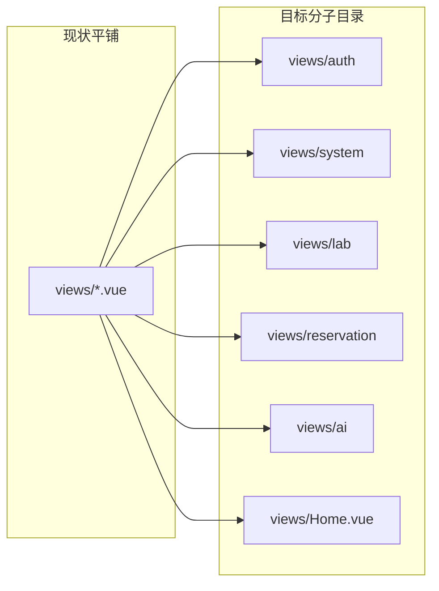

# 项目结构规范改造说明

> 状态：**代码已按本文落地**（views 分子目录、`api/files.js`、`services/agent/` 子包、根 `README.md`、交叉 docs 路径已更新）。  
> 复查（对照仓库）：`views/` 已按业务分子目录；`api/files.js` 已对齐；Agent 相关已在 `services/agent/`；根 `README.md` 已创建。

## 1. 改造目的

- 前端页面按业务分子目录，避免 `views/` 平铺难找。
- 前后端文件上传模块命名对齐（`files`）。
- 后端 Agent / 会话相关服务收拢为 `services/agent/` 子包，降低 `services/` 根目录噪音。
- 补根目录 `README.md`，方便启动与目录说明。
- **不改业务逻辑、API URL、菜单 path、表结构**。

## 1.1 FAQ：菜单 `path` 要不要改成文件路径？

**不要。** `menus.path`（及 `rbac_seed`）存的是**前端路由 URL**（如 `/manager/lab`），供：

- 侧栏 `el-menu`（`router` + `item.path`）跳转
- 路由守卫与 `to.path` / `getMenuPaths()` 做权限比对

`.vue` 文件路径（如 `views/lab/Lab.vue`）只出现在 [`frontend/src/router/index.js`](../frontend/src/router/index.js) 的 `import()` 里。

| 概念 | 示例 | 本轮是否改 |
|------|------|------------|
| 浏览器 URL / 菜单 path | `/manager/lab` | **不改** |
| 组件文件 | `@/views/lab/Lab.vue` | **改**（搬目录 + router import） |
| 表字段 `menus.component` | 模型有列，种子未填，前端也未按它动态加载路由 | **不改、不填文件路径**（本轮不做动态路由） |

## 2. 改造前后目录对比

### 2.1 仓库顶层（目标）

```text
lab-agent/
├── README.md                 # 新增
├── docs/
│   ├── Agent多轮对话与状态隔离.md
│   ├── 用户角色菜单设计.md
│   └── 项目结构规范改造.md   # 本文
├── backend/
│   └── app/
│       ├── api/
│       ├── schemas/
│       ├── models/
│       ├── services/
│       │   ├── agent/        # 新增子包（见下）
│       │   ├── *_service.py  # 业务服务保持平铺
│       │   └── ...
│       ├── dependencies/
│       ├── common/
│       ├── utils/
│       ├── config.py
│       ├── database.py
│       └── main.py
└── frontend/
    └── src/
        ├── api/
        ├── views/            # 分子目录（见下）
        ├── components/
        ├── layouts/
        ├── router/
        ├── utils/
        └── assets/
```

### 2.2 前端 views：现状 → 目标



目标树：

```text
frontend/src/views/
├── Home.vue
├── auth/
│   ├── Login.vue
│   ├── Register.vue
│   ├── Password.vue
│   └── Profile.vue
├── system/
│   ├── User.vue
│   ├── Role.vue
│   └── Menu.vue
├── lab/
│   ├── Lab.vue
│   ├── LabList.vue
│   ├── Equipment.vue
│   └── LabEquipment.vue
├── reservation/
│   ├── MyReservation.vue
│   └── AuditReservation.vue
└── ai/
    └── AIChat.vue
```

### 2.3 后端 Agent 子包：现状 → 目标

```text
# 现状（services 根目录）
backend/app/services/
├── agent_service.py
├── agent_tools.py
├── agent_checkpointer.py
├── ai_chat_session_service.py
├── ai_service.py              # 无引用，遗留
└── ...

# 目标
backend/app/services/
├── agent/
│   ├── __init__.py
│   ├── checkpointer.py        # ← agent_checkpointer.py
│   ├── tools.py               # ← agent_tools.py
│   ├── service.py             # ← agent_service.py
│   └── session_service.py     # ← ai_chat_session_service.py
├── kb_service.py
├── reservation_service.py
└── ...（其余业务服务仍平铺）
```

## 3. 文件搬迁对照表

### 3.1 前端 views

| 旧路径 | 新路径 |
|--------|--------|
| `frontend/src/views/Login.vue` | `frontend/src/views/auth/Login.vue` |
| `frontend/src/views/Register.vue` | `frontend/src/views/auth/Register.vue` |
| `frontend/src/views/Password.vue` | `frontend/src/views/auth/Password.vue` |
| `frontend/src/views/Profile.vue` | `frontend/src/views/auth/Profile.vue` |
| `frontend/src/views/User.vue` | `frontend/src/views/system/User.vue` |
| `frontend/src/views/Role.vue` | `frontend/src/views/system/Role.vue` |
| `frontend/src/views/Menu.vue` | `frontend/src/views/system/Menu.vue` |
| `frontend/src/views/Lab.vue` | `frontend/src/views/lab/Lab.vue` |
| `frontend/src/views/LabList.vue` | `frontend/src/views/lab/LabList.vue` |
| `frontend/src/views/Equipment.vue` | `frontend/src/views/lab/Equipment.vue` |
| `frontend/src/views/LabEquipment.vue` | `frontend/src/views/lab/LabEquipment.vue` |
| `frontend/src/views/MyReservation.vue` | `frontend/src/views/reservation/MyReservation.vue` |
| `frontend/src/views/AuditReservation.vue` | `frontend/src/views/reservation/AuditReservation.vue` |
| `frontend/src/views/AIChat.vue` | `frontend/src/views/ai/AIChat.vue` |
| `frontend/src/views/Home.vue` | `frontend/src/views/Home.vue`（不动） |

### 3.2 前端 api 命名对齐

| 旧路径 | 新路径 | 说明 |
|--------|--------|------|
| `frontend/src/api/file.js` | `frontend/src/api/files.js` | 与后端 `api/files.py`、URL `/api/files` 对齐；模块内 `url` **不改** |

### 3.3 后端 Agent 子包

| 旧路径 | 新路径 |
|--------|--------|
| `backend/app/services/agent_checkpointer.py` | `backend/app/services/agent/checkpointer.py` |
| `backend/app/services/agent_tools.py` | `backend/app/services/agent/tools.py` |
| `backend/app/services/agent_service.py` | `backend/app/services/agent/service.py` |
| `backend/app/services/ai_chat_session_service.py` | `backend/app/services/agent/session_service.py` |
| （新建） | `backend/app/services/agent/__init__.py` |

### 3.4 遗留文件

| 路径 | 处理 |
|------|------|
| `backend/app/services/ai_service.py` | 当前全仓无 import（旧 OpenAI function-calling 助手，已被 LangGraph Agent 替代）。落地时**确认无引用后删除**，不迁入 `agent/`。 |

## 4. 代码改动清单

### 4.1 前端路由（必改）

文件：[`frontend/src/router/index.js`](../frontend/src/router/index.js)

| 路由 name / path（保持不变） | 新 component import |
|------------------------------|---------------------|
| `Home` / `home` | `@/views/Home.vue` |
| `Lab` / `lab` | `@/views/lab/Lab.vue` |
| `Profile` / `profile` | `@/views/auth/Profile.vue` |
| `Password` / `password` | `@/views/auth/Password.vue` |
| `User` / `user` | `@/views/system/User.vue` |
| `Equipment` / `equipment` | `@/views/lab/Equipment.vue` |
| `labEquipment` / `lab-equipment` | `@/views/lab/LabEquipment.vue` |
| `LabList` / `lablist` | `@/views/lab/LabList.vue` |
| `MyReservation` / `my-reservation` | `@/views/reservation/MyReservation.vue` |
| `AuditReservation` / `audit-reservation` | `@/views/reservation/AuditReservation.vue` |
| `AIChat` / `ai-chat` | `@/views/ai/AIChat.vue` |
| `Role` / `role` | `@/views/system/Role.vue` |
| `Menu` / `menu` | `@/views/system/Menu.vue` |
| `Login` / `/login` | `@/views/auth/Login.vue` |
| `Register` / `/register` | `@/views/auth/Register.vue` |

说明：`path`、`name`、`WHITE_LIST` **一律不改**，以免菜单表 / RBAC 种子失效。

页面内现有 import 基本都是 `@/api`、`@/utils`、`@/components`，搬到子目录后**一般不用改页面内部路径**；唯一必改的 api 见下节 `file` → `files`。

### 4.1.1 硬编码 URL（勿改）

以下是路由 path，不是文件路径；搬 `views` **不要**改成 `views/lab/...` 之类：

| 文件 | 硬编码 path |
|------|-------------|
| `frontend/src/layouts/Layout.vue` | `/manager/profile`、`/manager/password` |
| `frontend/src/views/LabList.vue`（搬后 `lab/`） | `/manager/lab-equipment` |
| `frontend/src/views/LabEquipment.vue`（搬后 `lab/`） | `/manager/lablist` |
| `frontend/src/views/Home.vue` | `/manager/ai-chat`、`/manager/home` 相关判断 |
| `frontend/src/views/Login.vue`（搬后 `auth/`） | `/manager/home` |
| `frontend/src/views/Menu.vue`（搬后 `system/`） | 表单占位 `/manager/xxx` |
| `frontend/src/router/index.js` | `redirect`、`WHITE_LIST`、守卫回跳的 `/manager/...` |

`components/ReserveDialog.vue` 本轮不搬；`LabList` 等继续 `import ... from '@/components/ReserveDialog.vue'` 即可。

### 4.2 前端 `files` api 引用

`file.js` → `files.js` 后，改 import：

| 文件 | 旧 | 新 |
|------|----|----|
| `frontend/src/views/lab/Lab.vue`（搬迁后） | `@/api/file` | `@/api/files` |
| `frontend/src/views/lab/Equipment.vue` | `@/api/file` | `@/api/files` |
| `frontend/src/views/auth/Profile.vue` | `@/api/file` | `@/api/files` |

导出符号 `uploadFileApi`、请求 URL `/api/files/upload` 保持不变。  
后端 [`api/files.py`](../backend/app/api/files.py)、[`schemas/file.py`](../backend/app/schemas/file.py) **文件名不强制改**（本轮只对齐前端 `api/files.js`）。

### 4.3 后端 import（必改）

建议落地后的 import 约定：

```python
# main.py
from app.services.agent import checkpointer as agent_checkpointer
# 或
from app.services.agent.checkpointer import init_checkpointer, close_checkpointer

# api/ai.py
from app.services.agent import service as agent_service
from app.services.agent import session_service as ai_chat_session_service
# 或更短：
from app.services.agent.service import run_agent
from app.services.agent.session_service import create_session, ...

# agent/service.py 内部
from app.services.agent.tools import build_tools
from app.services.agent.checkpointer import get_checkpointer

# agent/session_service.py 内部
from app.services.agent.checkpointer import delete_thread
```

调用方对照：

| 文件 | 现状 import | 落地后方向 |
|------|-------------|------------|
| `backend/app/main.py` | `from app.services import agent_checkpointer, ...` | `app.services.agent.checkpointer` |
| `backend/app/api/ai.py` | `from app.services import agent_service, ai_chat_session_service` | `app.services.agent.service` / `session_service` |
| `agent/service.py`（原 agent_service） | `app.services.agent_tools` / `agent_checkpointer` | 子包内相对或绝对 import |
| `agent/session_service.py`（原 ai_chat_session） | `from app.services import agent_checkpointer` | `app.services.agent.checkpointer` |

`__init__.py` 可选再导出常用符号，便于 `from app.services.agent import ...`；若导出，注意避免循环 import（checkpointer 与 service）。

### 4.3.1 不进入 `services/agent/` 的边界

| 保持原位 | 原因 |
|----------|------|
| `backend/app/api/ai.py` | 仍是 HTTP 路由层 |
| `backend/app/models/ai_chat.py` | ORM 模型 |
| `backend/app/schemas/ai.py` | 请求/响应 Schema |
| `backend/app/services/kb_service.py` | 知识库/向量，被 tools 调用，非 Agent 运行时本体 |
| 其余 `*_service.py`（lab / reservation / rbac 等） | 业务服务，继续平铺 |

### 4.4 文档交叉更新（落地时）

#### A. [`docs/Agent多轮对话与状态隔离.md`](./Agent多轮对话与状态隔离.md)

| 旧 | 新 |
|----|----|
| `backend/app/services/agent_service.py` | `backend/app/services/agent/service.py` |
| `backend/app/services/agent_tools.py` | `backend/app/services/agent/tools.py` |
| `backend/app/services/agent_checkpointer.py` | `backend/app/services/agent/checkpointer.py` |
| `backend/app/services/ai_chat_session_service.py` | `backend/app/services/agent/session_service.py` |
| `frontend/src/views/AIChat.vue` | `frontend/src/views/ai/AIChat.vue` |

#### B. [`docs/用户角色菜单设计.md`](./用户角色菜单设计.md)

文中实现清单仍写旧路径，落地后改为：

| 旧 | 新 |
|----|----|
| `views/Role.vue` | `views/system/Role.vue` |
| `views/Menu.vue` | `views/system/Menu.vue` |
| `views/User.vue` | `views/system/User.vue` |
| `views/Home.vue` | `views/Home.vue`（仍在根） |
| `views/Profile.vue` | `views/auth/Profile.vue` |

该文档里的菜单 **URL path**（`/manager/...`）**不要**改。

### 4.5 根目录 README（落地时新建）

路径：仓库根目录 [`README.md`](../README.md)

建议大纲：

1. 项目简介（一句话）
2. 技术栈
3. 目录结构（简表）
4. 环境依赖：MySQL、Redis（Docker）、Python、Node
5. 后端启动：`venv` / `pip install -r requirements.txt` / `.env` / `uvicorn`
6. 前端启动：`npm install` / `npm run dev`
7. 关键配置说明：指向 `backend/.env.example`、`frontend/.env.development`
8. 文档索引：`docs/` 下各 MD

说明：已有 [`frontend/README.md`](../frontend/README.md)（Vite 模板说明）。根 README 写整仓启动与依赖；前端 README 可保留模板内容，或改为「详见根 README」，避免两套启动说明冲突。

## 5. 不改动项

| 类别 | 说明 |
|------|------|
| HTTP API 前缀与路径 | 如 `/api/files/upload`、`/api/ai/chat`、`/api/ai/sessions` |
| 前端路由 path / name | `/manager/lab`、`/manager/ai-chat` 等 |
| 菜单表 / RBAC 种子 path | `rbac_seed` 与库内 `menus.path`（保持 `/manager/...`） |
| `menus.component` | 本轮不启用、不填 vue 文件路径 |
| 数据库表与字段 | 含 `ai_chat_sessions` / `ai_chat_messages` |
| Agent / 预约业务逻辑 | 仅搬文件与改 import |
| `components/`、`layouts/`、`utils/` | 本轮不拆分 |
| 后端 `api/files.py`、`schemas/file.py` | 文件名保持；前端 `api` 改为 `files.js` |
| 业务内硬编码的 `/manager/...` | 见 §4.1.1，保持不变 |

## 6. 落地步骤与验收清单

### 6.1 建议落地顺序

1. 前端：建 `views` 子目录 → 移动 vue → 改 `router/index.js` → 本地打开各菜单页冒烟（含隐藏路由 `lab-equipment`）。
2. 前端：`file.js` → `files.js` → 改三处 upload import → 上传头像/实验室图冒烟。
3. 后端：建 `services/agent/` → 移动四文件并改名 → 写 `__init__.py` → 改 `main.py` / `api/ai.py` / 子包内部 import → 启动 lifespan（Redis checkpointer）→ 多轮对话与删会话冒烟。
4. 删除无用的 `ai_service.py`（确认无引用后）。
5. 更新 `docs/Agent多轮对话与状态隔离.md`、`docs/用户角色菜单设计.md` 中的文件路径链接（**不要**改其中的 `/manager` URL 说明）。
6. 新建根 `README.md`；按需收敛 `frontend/README.md` 启动说明。

### 6.2 验收清单

- [x] 前端所有动态 import 路径可解析，无 404 白屏（`npm run build` 通过）
- [x] 登录 / 注册 / 改密 / 个人中心正常（2026-10-02 API 联调已验证；浏览器视觉点检仍建议）
- [x] 用户 / 角色 / 菜单 CRUD 正常；菜单 path 仍为 `/manager/...`（2026-10-02 API 已验证；侧栏点击跳转建议手工）
- [x] 实验室 / 设备 / 预约 / 审核正常（2026-10-02 API 已验证）；`lablist` ↔ `lab-equipment` 互跳需手工
- [ ] AI 会话：「确认」续预约与侧栏切换/删除 UI 需手工；API 已验证新建 / 多轮对话 / 删会话（2026-10-02）
- [x] 文件上传仍走 `/api/files/upload`；前端模块名为 `api/files.js`（2026-10-02 上传接口冒烟通过）
- [x] 后端启动：RBAC seed、向量库预热、Redis checkpointer、预约过期扫描均正常（2026-10-02 本机 MySQL + Docker Redis 联调；启动日志含 Redis checkpointer 成功）
- [x] `ai_service.py` 已删除或明确保留理由
- [x] `docs/Agent多轮对话与状态隔离.md`、`docs/用户角色菜单设计.md` 文件路径已更新
- [x] 根目录 `README.md` 可按步骤跑起前后端
- [x] 库内 / 种子 `menus.path` **未**被改成 vue 文件路径

### 6.3 对照仓库的完整性核对（文档自检）

| 项 | 结论 |
|----|------|
| 前端 `views` 共 15 个 `.vue` | 搬迁表全覆盖（14 搬 + Home 不动） |
| 前端 `api` 仅 `file.js` 需改名 | 其余 `auth/lab/.../ai.js` 不动 |
| 后端 Agent 相关 4 文件 + 遗留 `ai_service` | 已列入 |
| Agent 外部调用方 | `main.py`、`api/ai.py` + 子包内部；无其它业务模块直接 import |
| 菜单 / 路由 URL | 明确不改；FAQ + 硬编码清单已写 |

## 7. 本阶段交付物

| 交付物 | 状态 |
|--------|------|
| `docs/项目结构规范改造.md`（本文） | 已完成（含复查补强；**代码已落地**） |
| 代码搬迁与 import 修改 | **已完成** |
| 根 `README.md` | **已完成** |
| 交叉更新其它 docs | **已完成** |
